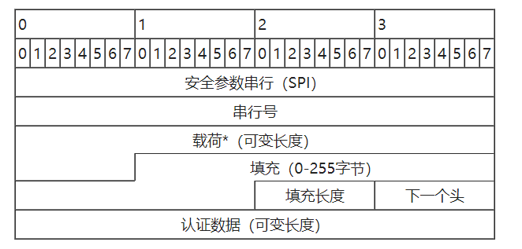
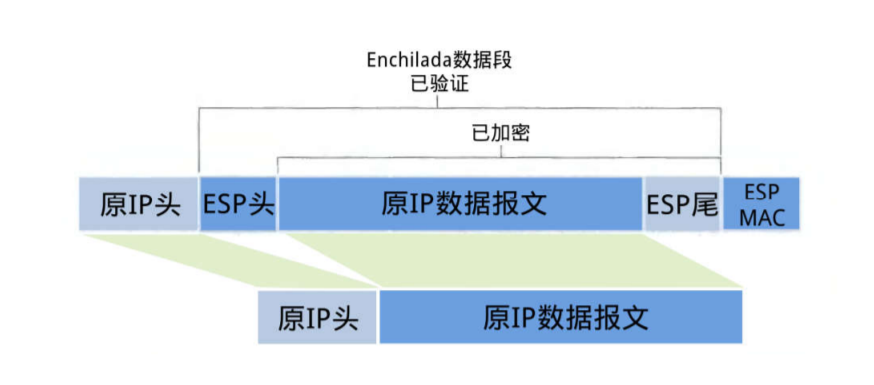
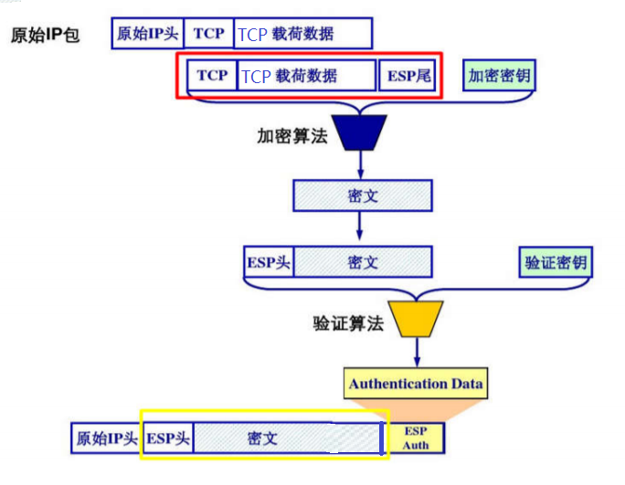
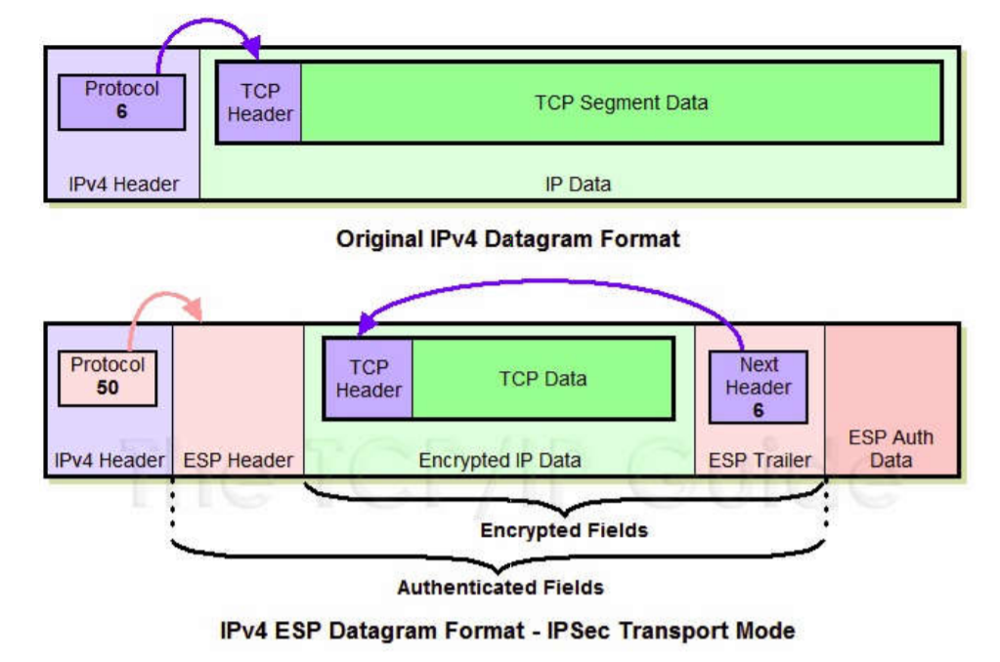
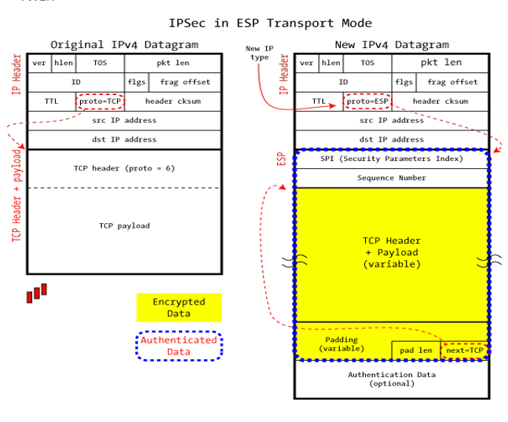

<!-- @import "[TOC]" {cmd="toc" depthFrom=1 depthTo=6 orderedList=false} -->

<!-- code_chunk_output -->

* [描述 IPSec 传输模式下 ESP 报文的装包与拆包过程](#描述-ipsec-传输模式下-esp-报文的装包与拆包过程)
	* [IPsec](#ipsec)
	* [ESP](#esp)
	* [传输模式](#传输模式)
	* [传输模式下的 ESP 包](#传输模式下的-esp-包)
	* [传输装拆包流程](#传输装拆包流程)
		* [装包过程](#装包过程)
			* [装包前后示意图](#装包前后示意图)
	* [拆包过程](#拆包过程)
* [参考资料](#参考资料)

<!-- /code_chunk_output -->

## 描述 IPSec 传输模式下 ESP 报文的装包与拆包过程

### IPsec
`IPsec` 是一个协议包，透过对 `IP` 协议的分组进行加密和认证来保护 `IP` 协议的网络传输协议族。
### ESP
`ESP（Encapsulating Security Payloads）`，封装安全载荷协议，`IPsec` 所支持的两类协议中的一种。该协议能够在数据的传输过程中对数据进行完整性度量，来源认证以及加密，可以选择加密，也可防止回放攻击。
说明：
1. 传输模式下 `ESP` 不对整个原始 `IP` 报文加密，而只加密其中不包括 IP 头的有效载荷部分。但在端对端的隧道通信中，`ESP` 需要对整个原始 IP 报文加密 （隧道模式）。
2. `ESP` 结构由 `IP` 协议号 `50` 标识，`ESP` 的封装结构随着所采用的传输模式和隧道模式有所不同。
3. `ESP` 可以单独使用，也可以和 `AH` 结合使用。

**ESP 分组**：

**字段含义**：
- **安全参数索引**：与IP地址一同用来标识安全参数
- **串行号**：单调递增的数值，用来防止重放攻击。
- **载荷数据**：实际要传输的数据。
- **填充**：某些块加密算法用此将数据填充至块的长度。
- **填充长度**：以位为单位的填充数据的长度。
- **下一个头**：标识被传送数据所属的协议。
- **认证数据**：包含了认证当前包所必须的数据。

### 传输模式
传输模式（`Transport Mode`）是`IPSec`的默认模式,又称端到端（`End-to-End`）模式，它适用于两台主机之间进行`IPSec`通信。
传输模式下只对`IP`负载进行保护，可能是`TCP/UDP/ICMP`协议，也可能是`AH/ESP`协议。传输模式只为上层协议提供安全保护，在此种模式下，参与通信的双方主机都必须安装`IPSec`协议，而且它不能隐藏主机的IP地址。
启用`IPSec`传输模式后，`IPSec`会在传输层包的前面增加`AH/ESP`头部或同时增加两种头部，构成一个`AH/ESP`数据包，然后添加`IP`头部组成`IP`包。在接收方，首先处理的是`IP`，然后再做`IPSec`处理，最后再将载荷数据交给上层协议。

### 传输模式下的 ESP 包

**总流程图：**

红色区域：加密区
黄色区域：验证区
PS:原本是网上流传的一张图，但是有些错误，这里我做了两个改动：
1.载荷数据改为 `TCP` 载荷数据。如果不写明 `TCP`，容易误解为 `IP` 的载荷数据，而`IP`的载荷数据是整个`TCP`报文。
2. 验证区应该是 **ESP+密文**，而不是原图的`ESP+密文+ESP尾`。
### 传输装拆包流程
#### 装包过程
1. 在原 IP 报文末尾添加尾部 `(ESP trailer)` 信息。尾部包含三部分：
- 填充 `(padding)`: 所选算法可能是块加密，最后一块长度不够时需要进行填充
- 填充长度 `(pad length)`:以字节为单位指示填充项长度  
- `Next header`: 用来标明被加密的数据报⽂文的类型，例如 `6=TCP`。注意` ESP header` 中没有 `Next header`, 而是放在了 `Trailer` 中。
2. 将原 `TCP` 报文和第 `1` 步得到的 `ESP trailer` 作为一个整体进行加密封装。具体的加密算法和密钥由 `SA` 给出。
3. 为第 2 步得到的密文添加 `ESP` 头。`ESP`头由 `SPI (Security Parameter Index)` 和 `Seq#` 两部分组成，加密数据与 `ESP` 头合称为`“enchilada”`。
4. 附加完整性度量结果（`ICV，Integrity check value`）。对第 2 步得到的`“enchilada”`做摘要，得到一个完整性度量值，并附在 `ESP` 报文的尾部。
5. 将原始的 IP 报文头中的协议号改为 `50`（代表 `ESP`），然后将 IP 报文头加到第 4 步的结果之前构成 `IPsec` 报文。

##### 装包前后示意图

可以明显看到结构上的变化：新增了ESP header,ESP Auth Data。其中 原本的TCP 报文和ESP trailer一起加密构成加密数据。
IP 头的协议号也从6(TCP)变为 50(ESP)

### 拆包过程
1. 接收方收到 `IP` 报文后，发现协议类型是 `50`，标明这是一个 `ESP` 包。首先查看 `ESP` 头，通过安全参数索引号 `SPI` 决定数据报文所对应的 `SA`，获得对应的模式（隧道或传输模式）以及安全规范。
2. 计算 `“enchilada”` 部分的摘要，与附在末尾的 `ICV` 做对比，验证数据完整性
3. 检查 `Seq#` 里的顺序号，保证数据是“新鲜”的。这里可以避免重放攻击。
4. 根据 `SA` 所提供的加密算法和密钥，解密被加密过的数据，得到原 `TCP` 报文与 `ESP` `trailer`
5. 根据` ESP trailer `的填充长度信息，找出填充字段的长度，删去后得到原来的 `TCP` 报文。
6. 最根据 `TCP` 报文头信息将报文交付给传输层处理。

## 参考资料
1. [TCP-IP 详解：ESP(IPSec Encapsulating Security Payload)](https://blog.csdn.net/wdscq1234/article/details/52705458)
2. [IPsec 维基百科](https://zh.wikipedia.org/wiki/IPsec)
4. [RFC 2406 封装安全载荷](https://tools.ietf.org/html/rfc2406)
3. 信息安全课程 PPT
