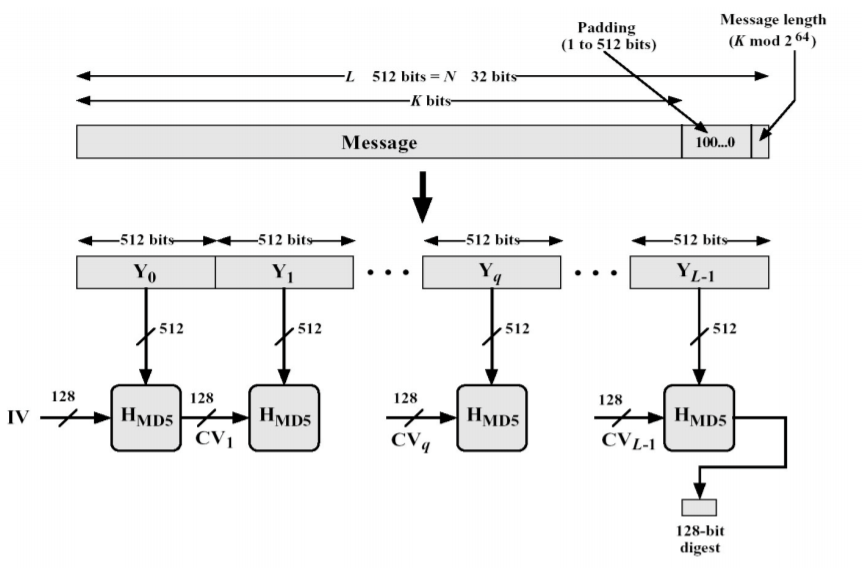
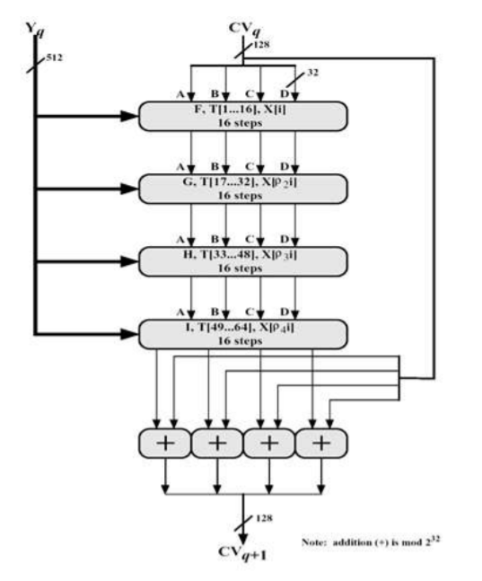
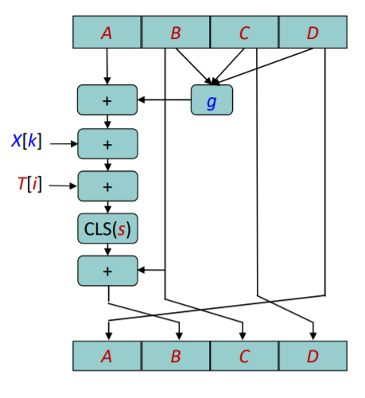
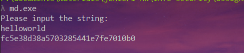
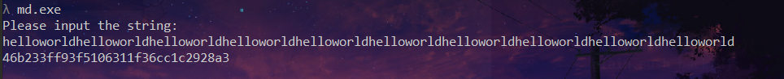
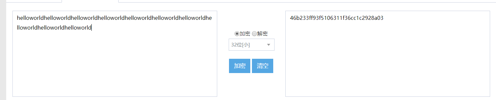

<!-- @import "[TOC]" {cmd="toc" depthFrom=1 depthTo=6 orderedList=false} -->

<!-- code_chunk_output -->

* [算法原理概述](#算法原理概述)
* [总体结构](#总体结构)
* [模块分解](#模块分解)
	* [填充](#填充)
	* [分块](#分块)
	* [初始化](#初始化)
	* [压缩函数](#压缩函数)
* [数据结构](#数据结构)
* [C 语言源代码](#c-语言源代码)
* [编译运行结果](#编译运行结果)

<!-- /code_chunk_output -->


## 算法原理概述
`MD5` 消息摘要算法（`MD5 Message-Digest Algorithm`），是一种被广泛使用的密码散列函数，可以产生出一个 `128` 位（`16` 字节）的散列值，用于确保信息传输完整一致。`MD5` 使用小端模式，输入任意不定长度信息，以 `512-bit` 进行分组，生成四个 `32-bit` 数据，最后联合输出固定 `128-bit` 的信息摘要
MD5 算法的基本过程：**填充、分块、缓冲区初始化、循环压缩、得出结果。**

## 总体结构
以` 512-bit` 消息分组为单位，每一分组$Y_q(q=0,1,..,L-1)$ 经过 4 个循环的压缩算法，表示为：
$CV_0= IV$
$CV_i = H_{MD5}(CV_{i-1},Y_i)$
输出结果 $MD = CV_L$
基本流程如下：


## 模块分解
主要分为填充、分块、初始化、压缩函数这四个部分。关键部分为**填充和压缩**

### 填充
在长度为 K bits 的原始消息数据尾部填充长度为 P bits 的标识
100…0，$1 \leq P\leq 512$ （即至少要填充 1 个 bit)，使得填充后的消息位
数为：$K + P \equiv 448 (mod 512)$.
再向上述填充好的消息尾部附加 K 值的低 64 位 （即 `K mod 264`)，
最后得到一个长度位数为 $K + P + 64 \equiv 0 (mod 512)$ 的消息。

### 分块
把填充后的消息结果分割为 L 个 `512-bit` 分组：$Y_0, Y_1, …, Y_{L-1}$。
分组结果也可表示成 N 个 32-bit 字 $M_0, M_1, …, M_{N-1}$，N = L*16。

### 初始化
寄存器 (A, B, C, D) 置 16 进制初值作为初始向量 IV，并采用小端
存储 (`little-endian`) 的存储结构：
```python
A = 0x67452301
B = 0xEFCDAB89
C = 0x98BADCFE
D = 0x10325476
```

### 压缩函数 
- $H_{MD5}$ 从 CV 输入 128 位，从消息分组输入 512 位，完成 4 轮循环后，输出 128 位，用于下一轮输入的 CV 值。
- 每轮循环分别固定不同的生成函数 $F,G,H,I$ 结合指定的 T 表元素 T[] 和消息分组的不同部分 X[] 做 16 次迭代运算，生成下一轮循环的输入
- 4 轮循环总共有 64 次迭代运算
- 4 轮循环中使用的生成函数（轮函数） g 是一个 32 位非线性逻辑函数，在相应各轮的定义如下：

| 轮次  | Function g  | g(b,c,d) |
|---|---|--|
| 1  | F(b,c,d)  | $(b\bigwedge c)\bigvee(\neg b\bigwedge d)$ |
| 2  | G(b,c,d)  | $(b\bigwedge c)\bigvee(c \bigwedge \neg d)$ |
| 3  | H(b,c,d)  | $b \bigoplus c \bigoplus d$ |
| 4  | I(b,c,d)  | $c\bigoplus (b)\bigvee \neg d $ |

压缩流程：


- 每轮循环中的一次迭代运算逻辑
  1. 对 A 迭代：$a\leftarrow b +((x+g(b,c,d)+X[k]+T[i])<<<s)$
  2. 缓冲区$(A,B,C,D)$ 作循环轮换：
    $(B,C,D,A) \leftarrow (A,B,C,D)$

- 说明：
  1. `a,b,c,d`: MD 缓冲区` (A,B,C,D)` 的当前值
  2. g: 轮函数 (F,G,H,I 中的一个）
  3. `<<<s` : 将 32 位输入循环左移 (CLS) s 位
  4. $X[k]$: 当前处理消息分组的第 k 个 `(k=0..15)` 32 位字，即 $M_{q*16+k}$
  5. $T[i]$：T 表的第 i 个元素，32 位字；T 表总共有 64 个元素，也称为加法常数
  6. +：模 $2^{32}$ 加法

每一次迭代流程图：


- **各轮循环中第 i 次迭代 $(i = 1..16)$ 使用的 X[k] 的确定：**
设 $j = i -1：$
    - 第 1 轮迭代：$k = j.$
    - 第 2 轮迭代：$k = (1 + 5j) mod 16.$
    - 第 3 轮迭代：$k = (5 + 3j) mod 16.$
    - 第 4 轮迭代：$k = 7j mod 16$.

- **T 表的生成**
  - $T[i] = int(2^{32}*|sin(i)|)$
    - `int` 取整函数，`sin` 正弦函数，以 `i` 作为弧度输入
具体的值在下面数据结构中给出。

## 数据结构
定义算法用到的表：
```python
unsigned int T[64] = {
    0xd76aa478, 0xe8c7b756, 0x242070db, 0xc1bdceee, 0xf57c0faf, 0x4787c62a,
    0xa8304613, 0xfd469501, 0x698098d8, 0x8b44f7af, 0xffff5bb1, 0x895cd7be,
    0x6b901122, 0xfd987193, 0xa679438e, 0x49b40821, 0xf61e2562, 0xc040b340,
    0x265e5a51, 0xe9b6c7aa, 0xd62f105d, 0x02441453, 0xd8a1e681, 0xe7d3fbc8,
    0x21e1cde6, 0xc33707d6, 0xf4d50d87, 0x455a14ed, 0xa9e3e905, 0xfcefa3f8,
    0x676f02d9, 0x8d2a4c8a, 0xfffa3942, 0x8771f681, 0x6d9d6122, 0xfde5380c,
    0xa4beea44, 0x4bdecfa9, 0xf6bb4b60, 0xbebfbc70, 0x289b7ec6, 0xeaa127fa,
    0xd4ef3085, 0x04881d05, 0xd9d4d039, 0xe6db99e5, 0x1fa27cf8, 0xc4ac5665,
    0xf4292244, 0x432aff97, 0xab9423a7, 0xfc93a039, 0x655b59c3, 0x8f0ccc92,
    0xffeff47d, 0x85845dd1, 0x6fa87e4f, 0xfe2ce6e0, 0xa3014314, 0x4e0811a1,
    0xf7537e82, 0xbd3af235, 0x2ad7d2bb, 0xeb86d391};

const unsigned char s[64] = {7, 12, 17, 22, 7, 12, 17, 22, 7, 12, 17, 22, 7, 12, 17, 22,
             5, 9, 14, 20, 5, 9, 14, 20, 5, 9, 14, 20, 5, 9, 14, 20,
             4, 11, 16, 23, 4, 11, 16, 23, 4, 11, 16, 23, 4, 11, 16, 23,
             6, 10, 15, 21, 6, 10, 15, 21, 6, 10, 15, 21, 6, 10, 15, 21};

const unsigned char X[4][16] = {{0, 1, 2, 3, 4, 5, 6, 7, 8, 9, 10, 11, 12, 13, 14, 15},
                                                {1, 6, 11, 0, 5, 10, 15, 4, 9, 14, 3, 8, 13, 2, 7, 12},
                                                {5, 8, 11, 14, 1, 4, 7, 10, 13, 0, 3, 6, 9, 12, 15, 2},
                                                {0, 7, 14, 5, 12, 3, 10, 1, 8, 15, 6, 13, 4, 11, 2, 9}
};

```

## C 语言源代码 
完整代码在 `md5.cpp,md5.h` 中
编译：`g++ main.cpp md5.cpp -o md5`
运行：`md5`, 输入要处理的字符串，即可得到输出 
首先我将字符串进行分块并且即时进行处理，使用 count 记录总位数。每个字符为 `char` 类型，`8 bits`, 因此一个块包含 `64` 个字符，对每一块进行处理，并且对于最后一个不足 `512 bits` 的块进行填充。
```c++
void md5::process()
{
  while(plain.size()>=64){
    for(int i = 0; i < 16; i++)
    {//四个 bytes 组成 一个 int
      block[i] = ((unsigned int)plain[3] << 24)+((unsigned int)plain[2] << 16) + ((unsigned int)plain[1] << 8) + ((unsigned int)plain[0]);
      plain.erase(plain.begin(),plain.begin()+4);
      count +=32;
    }
    compress();
  }
  //多余的进行 padding
  count += plain.size()*8;
  padding();
  display();
}
```
block 是长度为 16 的 int 数组，代表一个块。
**padding** :
```python
void md5::padding(){
  if(plain.size()<56){
    plain.push_back(0x80); //填充 1
  }
  //填充 0 至 448 bit
  while(plain.size()<56){
    plain.push_back(0);
  }
  //附加 k 值的低 64 位
  for(int i=0;i<8;i++){
    plain.push_back((count>>i*8)%(1<<8));
  }
```
**压缩函数**，进行 4 次循环，每次 16 个迭代，每次循环使用不同的轮函数：
```c++
void md5::compress(){
  unsigned int cv[4];
  cv[0] = A; cv[1] = B; cv[2] = C; cv[3] = D;
  unsigned int a;
  for(int j=0;j<4;j++){
    for(int i=0;i<16;i++){
      a = A;
      a += block[X[j][i]] + T[j*16+i];
      switch (j){
        case 0:
          a += ((B & C) | ((~B) & D));
          break;
        case 1:
          a += (((B) & (D)) | ((C) & (~D)));
          break;
        case 2:
          a += (((B) ^ (C)) ^ (D));
          break;
        case 3:
          a += (C ^ (B | (~D)));
          break;
        default:
          break;
      }
      //循环左移
      a = (a << s[j * 16 + i] | a >> (32 - s[j * 16 + i])) + B;
      //循环轮换
      A = D;
      D = C;
      C = B;
      B = a;
    }
  }
  A += cv[0];
  B += cv[1];
  C += cv[2];
  D += cv[3];
}
```
**显示结果**，对结果进行编码并且显示为 16 进制：
```c++
void md5::display(){
  unsigned int result[16];
  for(int i = 0; i < 4; i++)
  {
    result[i] = (A>>i*8)&0xFF;
    result[i+4] = (B>>i*8)&0xFF;
    result[i+8] = (C>>i*8)&0xFF;
    result[i+12] = (D>>i*8)&0xFF;
  }
  std::ostringstream ss;
  ss << std::hex;
  for (int i = 0; i < 16; i++)
  {
    ss << (int)result[i];
  }
  cout << ss.str() << endl;
}
```

## 编译运行结果
输入较短的字符串：


输出较长的字符串（大于 64)



测试结果均一致，实现的 MD5 正确。
