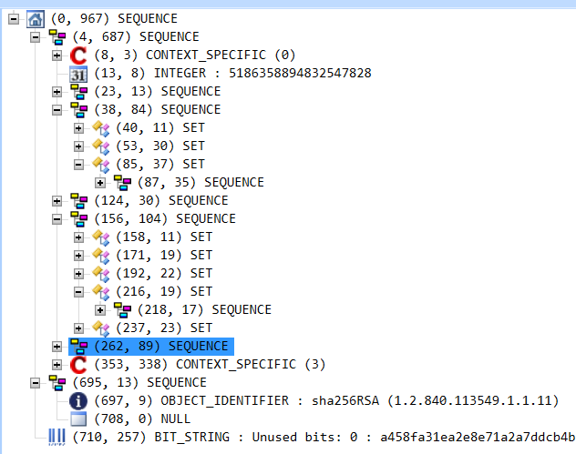
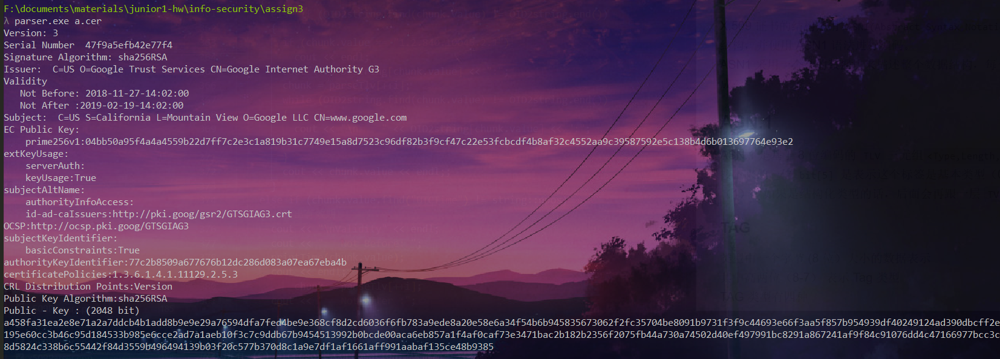

<!-- @import "[TOC]" {cmd="toc" depthFrom=1 depthTo=6 orderedList=false} -->

<!-- code_chunk_output -->

* [介绍](#介绍)
* [结构描述](#结构描述)
	* [ASN.1](#asn1)
		* [TAG](#tag)
		* [Length](#length)
		* [value](#value)
		* [数据块结束标识](#数据块结束标识)
	* [OID](#oid)
	* [X.509](#x509)
		* [待签名证书](#待签名证书)
		* [证书版本](#证书版本)
		* [序列号](#序列号)
		* [有效期](#有效期)
		* [签发者和使用者](#签发者和使用者)
		* [签名算法](#签名算法)
		* [拓展部分](#拓展部分)
* [实现及源代码](#实现及源代码)
* [编译运行输出结果](#编译运行输出结果)
* [总结](#总结)
* [参考链接](#参考链接)

<!-- /code_chunk_output -->


## 介绍
X.509 是密码学里公钥证书的格式标准。
## 结构描述

X.509 证书的结构是用 `ASN1(Abstract Syntax Notation One)` 进行描述数据结构，并使用 ASN1 语法进行编码。
ASN1 采用一个个的数据块来描述整个数据结构，每个数据块都有四个部分组成：
### ASN.1
ASN.1 是基于 8 位编码的 `TLV` 三元组`<Type,Length,Value>`的
接下来的一位 `bit[5]` 是表示这个标签是基本类型（0）还是结构化类型（1），如果是结构化类型的话，后面会再跟一层 `TVL`；

#### TAG
类型由一个字节 (8 位）大小的数据表示
其中高两位（8-7） 表示 Tag 类型
TAG 类型有四种
```
1. universal(00)
2. application(01)
3. context-specific(10)
4. private(11)
```
第六位表示是否为结构化类型：
- 0: 简单类型
- 1：结构类型

剩余的五位 (5-1) 就是表示具体的类型

在 ASN.1 中的 `Universal` 类型如下表：（这些类型也是我们解析时候的主要类型）
|Tag Value	|Tag 类型|
|---|---|
|1	|BOOLEAN|
|2	|INTEGER||
|3	|BIT STRING|
|4	|OCTET STRING|
|5	|NULL|
|6	|OBJECT IDENTIFIER|
|7	|ObjectDescripion|
|8	|EXTERNAL,INSTANCE OF|
|9	|REAL|
|10|	ENUMERATED|
|11|	EMBEDDED| PDV
|12|	UFT8String|
|13|	RELATIVE|-OID
|14|	保留|
|15|	保留|
|16|	SEQUENCE,SEQUENCE OF |
|17|	SET,SET OF |
|18|	NumericString|
|19|	PrintableString|
|20|	TeletexString|,T61String
|21|	VideotexString|
|22|	IA5String|
|23|	UTCTime|
|24|	GeneralizedTime|
|25|	GraphicString|
|26|	VisibleString|,ISO646String
|27|	GeneralString|
|28|	UniversalString|
|29|	CHARACTER| STRING
|30|	BMPString|
|31|	保留|

#### Length
长度字段，有两种编码格式。

1. `length <=127`，用一个字节表示，`bit8 = 0`, `bit7-bit1` 存放长度值；
2. `length >127`，用多个字节表示，可以有 2 到 127 个字节。第一个字节的第 8 位为 1，其它低 7 位给出后面该域使用的字节的数量，从该域第二个字节开始给出数据的长度，高位优先。
特殊情况：还有一种特殊情况，这个字节为 `0x80`，表示数据块长度不定，由数据块结束标识结束数据块。

#### value
存放数据块的值，具体编码随数据块类型不同而不同。
#### 数据块结束标识
结束标示字段，两个字节（0x0000）, 只有在长度值为不定时才会出现。

### OID
对象标识符是由国际电信联盟 (ITU) 和 ISO/IEC 标准化的标识符机制，用于表示对一个对象、概念或者事务的全球化的一种标识。

`OID` 是由一连串以点。分隔的数字组成，
二进制数据转换成 OID 字符串
每 8 位读取二进制数据，一块的第一位表示是否为结束块
如果是 1 就和后面的连在一起
如果是 0 就是一个独立的块。
对第一位进行特殊处理，转化为两位：
- 第一位：`min([X/40], 2)`
- 第二位：` X - 40 * 第一位`
如 83 = 40*2+3 解析为 2 和 3

具体细节可以查看：http://luca.ntop.org/Teaching/Appunti/asn1.html
```
BER encoding. Primitive. Contents octets are as follows, where value1, ..., valuen denote the integer values of the components in the complete object identifier:

The first octet has value `40 * value1 + value2`. (This is unambiguous, since value1 is limited to values 0, 1, and 2; value2 is limited to the range 0 to 39 when value1 is 0 or 1; and, according to X.208, n is always at least 2.)

The following octets, if any, encode value3, ..., valuen. Each value is encoded base 128, most significant digit first, with as few digits as possible, and the most significant bit of each octet except the last in the value's encoding set to "1."
Example: The first octet of the BER encoding of RSA Data Security, Inc.'s object identifier is 40 * 1 + 2 = 42 = 2a(16). The encoding of 840 = 6 * 128 + 48(16) is 86 48 and the encoding of 113549 = 6 * 1282 + 77(16) * 128 + d(16) is 86 f7 0d. This leads to the following BER encoding: 06 06 2a 86 48 86 f7 0d
```
### X.509
**结构**：
- 待签名证书：包含证书的主要信息
- 签名算法：OID 对象
- 签名值：字符串
```python
Certificate  ::=  SEQUENCE  {
	tbsCertificate       TBSCertificate,       //待签名证书
	signatureAlgorithm   AlgorithmIdentifier, //签名算法
	signatureValue       BIT STRING // 签名值
	}
```
ASN.1 的形式
```python
<证书的类型，证书数据的长度，
	<tbsCertificate 的类型，tbsCertificate 长度，<数据> >
	<signatureAlgorithm 的类型，signatureAlgorithm 长度，<数据> >
	<signatureValue 的类型-比特字符串，signatureValue 的长度，<数据> >
>
```

#### 待签名证书

```
TBSCertificate  ::=  SEQUENCE  {
    version         [0]  EXPLICIT Version DEFAULT v1,
    serialNumber         CertificateSerialNumber,
    signature            AlgorithmIdentifier,
    issuer               Name,
    validity             Validity,
    subject              Name,
    subjectPublicKeyInfo SubjectPublicKeyInfo,
    issuerUniqueID  [1]  IMPLICIT UniqueIdentifier OPTIONAL,
                         -- If present, version shall be v2 or v3
    subjectUniqueID [2]  IMPLICIT UniqueIdentifier OPTIONAL,
                         -- If present, version shall be v2 or v3
    extensions      [3]  EXPLICIT Extensions OPTIONAL
                         -- If present, version shall be v3        }
———————————————————————————————————————————————————————                         
Version  ::=  INTEGER  {  v1(0), v2(1), v3(2)  }

CertificateSerialNumber  ::=  INTEGER

Validity ::= SEQUENCE {
     notBefore      Time,
     notAfter       Time }

Time ::= CHOICE {
     utcTime        UTCTime,
     generalTime    GeneralizedTime }

UniqueIdentifier  ::=  BIT STRING

SubjectPublicKeyInfo  ::=  SEQUENCE  {
     algorithm            AlgorithmIdentifier,
     subjectPublicKey     BIT STRING  }

```
主要信息有版本号、证书序列号、签名算法、签发者、有效期、使用者

#### 证书版本
识别用于该证书的 X.509 标准的版本，这可以影响证书中所能指定的信息。
三个版本
- V1 版本：对应值为 0，证书只有基本项
- V2 版本：对应值为 1，证书中除了基本型外，还包含了签发者 ID 与使用者 ID
- V3 版本：对应值为 2，证书中包含扩展项

X.509 证书包含以下数据（版本：v3)

#### 序列号
发放证书的实体有责任为证书指定序列号，以使其区别于该实体发放的其它证书。此信息用途很多。例如，如果某一证书被撤消，其序列号将放到证书撤消清单 (CRL) 中。


#### 有效期
每个证书均只能在一个有限的时间段内有效。该有效期以起始日期和时间及终止日期和时间表示，可以短至几秒或长至一世纪。所选有效期取决于许多因素，例如用于签写证书的私钥的使用频率及愿为证书支付的金钱等。它是在没有危及相关私钥的条件下，实体可以依赖公钥值的预计时间。可选的类型有 UTCTime 和 GeneralizedTime 两种。

#### 签发者和使用者
是一些 DN 项（Distinguish Name）的集合
|属性类型名称	|含义	|简写|
|---|---|---|
|Common Name|	通用名称|	CN|
|Organizational Unit name|	机构单元名称|	OU|
|Organization name	|机构名|	O|
|Locality|	地理位置|	L|
|State or province name|	州/省名|	|S|
|Country	|国名	|C|

#### 签名算法
这里的签名算法和之前的签名算法必须对应，否则证书无法验证通过。
签名算法的定义如下（RFC2459 Section4.1.1.2）：

```python
AlgorithmIdentifier ::= SEQUENCE {
        algorithm               OBJECT IDENTIFIER,
        parameters              ANY DEFINED BY algorithm OPTIONAL }
   parameters:
   Dss-Parms ::= SEQUENCE { -- parameters ，DSA(DSS) 算法时的 parameters,

RSA 算法没有此参数
        p             INTEGER,
        q             INTEGER,
        g             INTEGER }
 
signatureValue：
Dss-Sig-Value ::= SEQUENCE { -- sha1DSA 签名算法时，签名值
                   r       INTEGER,
                      s       INTEGER }
 
   Name ::= CHOICE {
     RDNSequence }
   RDNSequence ::= SEQUENCE OF RelativeDistinguishedName
   RelativeDistinguishedName ::=
     SET OF AttributeTypeAndValue
   AttributeTypeAndValue ::= SEQUENCE {
     type     AttributeType,
     value    AttributeValue }
   AttributeType ::= OBJECT IDENTIFIER
   AttributeValue ::= ANY DEFINED BY AttributeType
 
   Validity ::= SEQUENCE {
        notBefore      Time,  -- 证书有效期起始时间
        notAfter       Time  -- 证书有效期终止时间
        }
   Time ::= CHOICE {
        utcTime        UTCTime,
        generalTime    GeneralizedTime }
   UniqueIdentifier ::= BIT STRING
   SubjectPublicKeyInfo ::= SEQUENCE {
        algorithm            AlgorithmIdentifier, -- 公钥算法
        subjectPublicKey     BIT STRING            -- 公钥值
        }
subjectPublicKey:
RSAPublicKey ::= SEQUENCE { -- RSA 算法时的公钥值
         modulus            INTEGER, -- n
         publicExponent     INTEGER -- e -- }
 
```
#### 拓展部分
结构：
```python
  Extension ::= SEQUENCE {
        extnID      OBJECT IDENTIFIER,
        critical    BOOLEAN DEFAULT FALSE,
        extnValue   OCTET STRING }
```

`extnID`：表示一个扩展元素的 OID

`critical`：表示这个扩展元素是否极重要

`extnValue`：表示这个扩展元素的值，字符串类型。

我们可以使用 ASN.1 editor 查看一个证书的结构


## 实现及源代码
完整代码在 `x509Parser.cpp` 和 `x509Parser.h` 中，下面贴出关键部分的代码：
程序读取 `base64` 格式的证书，
`base64` 转化为 byte, 每 4 个 `base64` 字符转化为 3 个 字节
```c++
vector<BYTE> x509Parser::base642Byte(string base64str)
{
  //padding
   while (base64str.size() % 4 != 0)
  {
    base64str.push_back('=');
  }
  size_t encoded_size = base64str.size();
  std::vector<unsigned char> ret;
  ret.reserve(3 * encoded_size / 4);

  for (size_t i = 0; i < encoded_size; i += 4)
  {
    unsigned char b4[4];
    b4[0] = from_base64[base64str[i + 0]];
    b4[1] = from_base64[base64str[i + 1]];
    b4[2] = from_base64[base64str[i + 2]];
    b4[3] = from_base64[base64str[i + 3]];

    unsigned char b3[3];
    b3[0] = ((b4[0] & 0x3f) << 2) + ((b4[1] & 0x30) >> 4);
    b3[1] = ((b4[1] & 0x0f) << 4) + ((b4[2] & 0x3c) >> 2);
    b3[2] = ((b4[2] & 0x03) << 6) + ((b4[3] & 0x3f));

    ret.push_back(b3[0]);
    ret.push_back(b3[1]);
    ret.push_back(b3[2]);
  }

  return ret;
}
```
因为数据都是以 `TLV(tag,length,value)` 方式存储的，因此定义结构体 tlv, 在解析的时候也解析成一个个 `tlv`
```c++
typedef struct
{
  int tag;
  int length;
  string value;
} tlv;
```
解析 `OID`，具体的结构已经在前面提到过：
```c++
  } else if (tag == 6) { // OBJECT_IDENTIFIER OID 解析
      int firstval = min((data[p] & 0x7f) / 40, 2);
      int secondval = data[p] & 0x7f - 40 * firstval;
      value.append(to_string(firstval) + "." +
                   to_string(secondval)); //解析第一个 byte
      //读取接下来字节，并且根据最高位判断是否为结束块
      firstval = 0;
      for (size_t i = 1; i < len; i++) {
        firstval = (firstval << 7);
        firstval += int(data[i + p]) & 0x7f;
        if (!(int(data[p + i]) & 0x80)) //如果最高位是0 说明是一独立的块
        {
          value.append("." + to_string(firstval));
          firstval = 0;
        }
      }
      parseTlv.push_back({tag, len, value});
```

计算每个 `tlv` 的长度：
```c++
     len = 0;
     lenBytes = 1;
     if (data[p] & 0x80) /*判断最高是否为 1*/
     {
      lenBytes = data[p] & 0x7f; //长度使用的字节数量
      p++;
      for (int j = 0; j < lenBytes; j++) {
        len <<= 8;
        len += int(data[p + j]);
      }
     }
    else {//最高为 0，直接取长度值
       len = int(data[p]) & 0x7f;
     }
```

解析 `ASN.1`，根据 `tag` 的不同执行不同的操作，有些 `tag` 的操作是一样的，因此可以把它们放在一起，使用了递归解析：
```c++
 if (tag == 48 || tag == 49 || tag == 8) // SET SEQUENCE OCTET_STRING
    {
      parseAns1(data, p, p + len);
```
读取字符串
```c++
  else if (tag == 23 || tag == 22 || tag == 19 || tag == 134 ||
               tag == 12) { // UTCTime IA5String  PrintableString
                            // CONTEXT_SPECIFIC (6) UTF8String
      if (tag == 23) {
        value = "UTCTime ";
      }
      for (size_t i = 0; i < len; i++) {
        value += (char)data[i + p];
      }
      parseTlv.push_back({tag, len, value});
```
`bit string`, 需要跳过 `00`:
```c++
else if (tag == 3) { // BIT_STRING
      char tmp[3];
      for (size_t i = 0; i < len - 1; i++) {
        sprintf(tmp, "%02x", int(data[i + p + 1]));
        value += string(tmp);
      }
      parseTlv.push_back({tag, len, value});
```

定义 `OID` 的映射表，输出的时候直接输出对应的值：
```c++
map<string, string> OID2Algorithm = {
    {"1.2.840.10040.4.1", "DSA"},
    {"1.2.840.10040.4.3", "sha1DSA"},
    {"1.2.840.113549.1.1.1", "RSA"},
    {"1.2.840.113549.1.1.2", "md2RSA"},
    {"1.2.840.113549.1.1.3", "md4RSA"},
    {"1.2.840.113549.1.1.4", "md5RSA"},
```
所有的解析结果都会放在一个 `tlv` 的 `vector` 里面，因此输出的时候遍历即可。因为拓展部分会有多层 `OID` 嵌套，因此使用了 `while` 输出：
```c++
else if(OID2string.find(chunk.value)!=OID2string.end()){
      cout << OID2string[chunk.value] << " : " ;
      chunk = parseTlv[++i];
      while (OID2string.find(chunk.value) != OID2string.end()){
        cout << "\n    " << OID2string[chunk.value] << ":" ;
        chunk = parseTlv[++i];
      }
      cout << chunk.value << endl;
    }
```

## 编译运行输出结果

编译：
`g++ .\main.cpp .\x509Parser.cpp -o parser -g`
运行
`parser.exe a.cer`
即可看到解析后的结果：

结果的输出拓展的地方缩进不是很好.. 但是不影响理解,版本、算法、主体、有效期等信息都能展示出来。                                                                                                                                                       

使用  `openssl x509 -in cert.cer -text  -noout` 进行测试，或者使用 ASN.1 Editor 进行查看，对照结果正确。

## 总结
代码编写过程中有很多坑，比如文件读取的时候注意有没有回车问题，不然会导致后续数据全部出现问题。解析的时候注意下标的变化，推荐一边调试一边使用 `ASN.1 Editor` 对照。 转换的时候要 `bitstring` 读的时候有个 `00` 需要跳过。还有注意 int 类型和 char 类型的转换。..
代码还存在许多不足：
1. 对于 OID 的解析，没有把全部数据弄下来。因此如果证书中出现找不到映射的 OID, 会直接输出 OID。
2. `tag` 部分的解析，按照文档，是其中高两位表示 Tag 类型，第六位表示是否位结构化类型，剩余的五位 `(5-1)` 就是表示具体的类型。但是我直接把一整个字节的值作为 `TAG` 了。没有进一步解析。
3. 对于 `tag` 各种不同的类型只实现了基本的，还有很多类型没有解析。
4. 代码的风格不是很好。..

## 参考链接
[X.509 数字证书结构和实例](https://www.cnblogs.com/chnking/archive/2007/08/28/872104.html?)
[ASN.1 JavaScript decoder](http://www.lapo.it/asn1js/#MIIDITCCAoqgAwIBAgIQT52W2WawmStUwpV8tBV9TTANBgkqhkiG9w0BAQUFADBMMQswCQYDVQQGEwJaQTElMCMGA1UEChMcVGhhd3RlIENvbnN1bHRpbmcgKFB0eSkgTHRkLjEWMBQGA1UEAxMNVGhhd3RlIFNHQyBDQTAeFw0xMTEwMjYwMDAwMDBaFw0xMzA5MzAyMzU5NTlaMGgxCzAJBgNVBAYTAlVTMRMwEQYDVQQIEwpDYWxpZm9ybmlhMRYwFAYDVQQHFA1Nb3VudGFpbiBWaWV3MRMwEQYDVQQKFApHb29nbGUgSW5jMRcwFQYDVQQDFA53d3cuZ29vZ2xlLmNvbTCBnzANBgkqhkiG9w0BAQEFAAOBjQAwgYkCgYEA3rcmQ6aZhc04pxUJuc8PycNVjIjujI0oJyRLKl6g2Bb6YRhLz21ggNM1QDJywI8S2OVOj7my9tkVXlqGMaO6hqpryNlxjMzNJxMenUJdOPanrO_6YvMYgdQkRn8Bd3zGKokUmbuYOR2oGfs5AER9G5RqeC1prcB6LPrQ2iASmNMCAwEAAaOB5zCB5DAMBgNVHRMBAf8EAjAAMDYGA1UdHwQvMC0wK6ApoCeGJWh0dHA6Ly9jcmwudGhhd3RlLmNvbS9UaGF3dGVTR0NDQS5jcmwwKAYDVR0lBCEwHwYIKwYBBQUHAwEGCCsGAQUFBwMCBglghkgBhvhCBAEwcgYIKwYBBQUHAQEEZjBkMCIGCCsGAQUFBzABhhZodHRwOi8vb2NzcC50aGF3dGUuY29tMD4GCCsGAQUFBzAChjJodHRwOi8vd3d3LnRoYXd0ZS5jb20vcmVwb3NpdG9yeS9UaGF3dGVfU0dDX0NBLmNydDANBgkqhkiG9w0BAQUFAAOBgQAhrNWuyjSJWsKrUtKyNGadeqvu5nzVfsJcKLt0AMkQH0IT_GmKHiSgAgDpulvKGQSy068Bsn5fFNum21K5mvMSf3yinDtvmX3qUA12IxL_92ZzKbeVCq3Yi7LeIOkKcGQRCMha8X2e7GmlpdWC1ycenlbN0nbVeSv3JUMcafC4-Q)
[X.509 证书解析](https://wuziqingwzq.github.io/ca/2018/05/11/x509-knowledge-asn2.html)
推荐软件：[ASN.1 Editor](https://www.sysadmins.lv/projects/asn1editor/default.aspx)
一些 OID 的表：http://lapo.it/asn1js/oids.js
查询 OID：http://www.oid-info.com/
